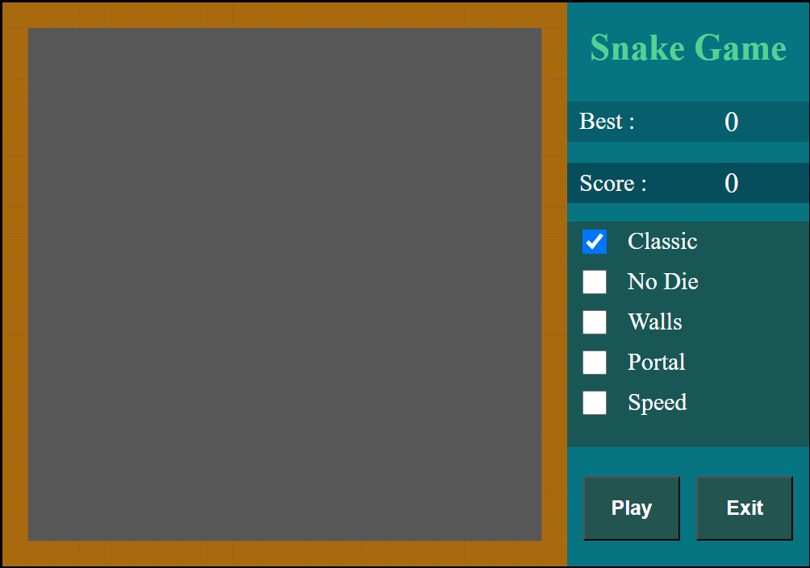
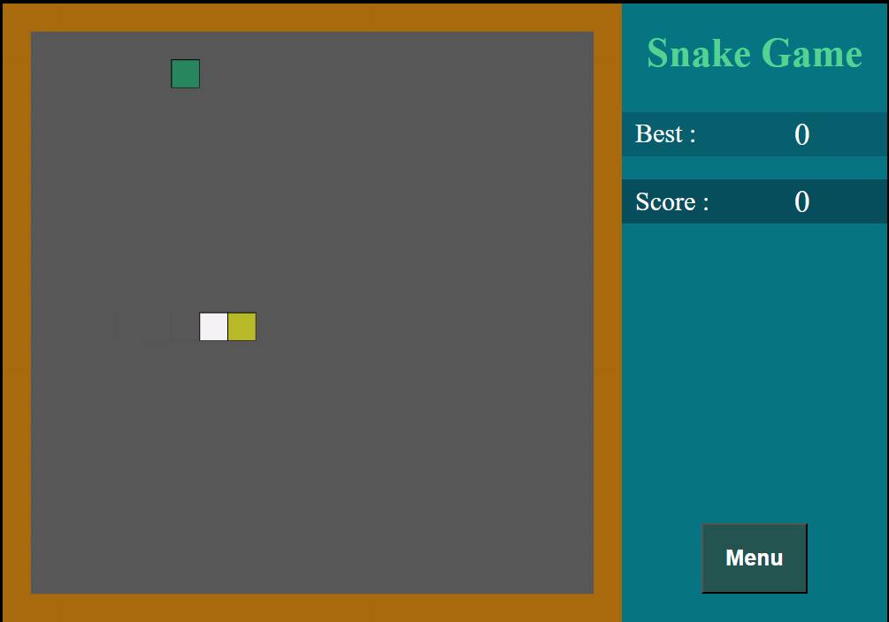

# Snake

Game Snake

Conditions:

- Use Pixi.js and vanilla JavaScript.
- Use arrow keys to control the snake.
- Use OOP concepts.
- The game screen needs to have a game field and GUI.
- The snake's starting size is equal to 3.
- The field size is 20x20.
- GUI:
	- Label: "Best Score"
	- Label: "Current Score"
	- When playing, show a button: "Menu"
	- When not playing, show buttons: "Play" and "Exit"
	- Radio list with game modes
	
	
Game Modes:

- Classic( Classic snake game: The game ends if the snake hits the edge of the game field or its own body )
- God mode( The snake can't die. It passes through its own body and goes through the wall )
- Walls( When the snake eats food, new food spawns, and one wall cell also spawns in a random place on the field. );
- Portal( At the same time on field have two cell of food. When snake eat one of them, she spawn in second food cell and save direction. The body movement is gradual, not all at once, one step, one cell of the body );
- Speed( When the snake eats food, it speeds up by 10% );

